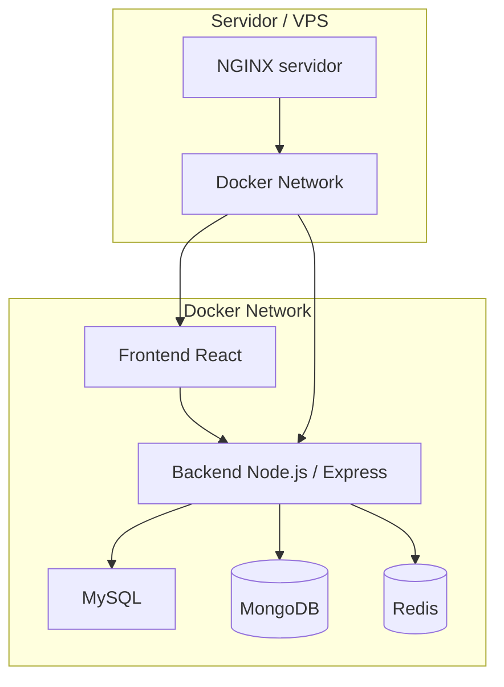

```mermaid
    graph TD
        subgraph Servidor / VPS
            nginx_host[NGINX servidor]
            docker_network[Docker Network]
            nginx_host --> docker_network
        end
    
        subgraph Docker Network
            frontend[Frontend React]
            backend[Backend Node.js / Express]
            mysql[MySQL]
            mongo[(MongoDB)]
            redis[(Redis)]
    
            frontend --> backend
            backend --> mysql
            backend --> mongo
            backend --> redis
        end
    
        docker_network --> frontend
        docker_network --> backend
```
