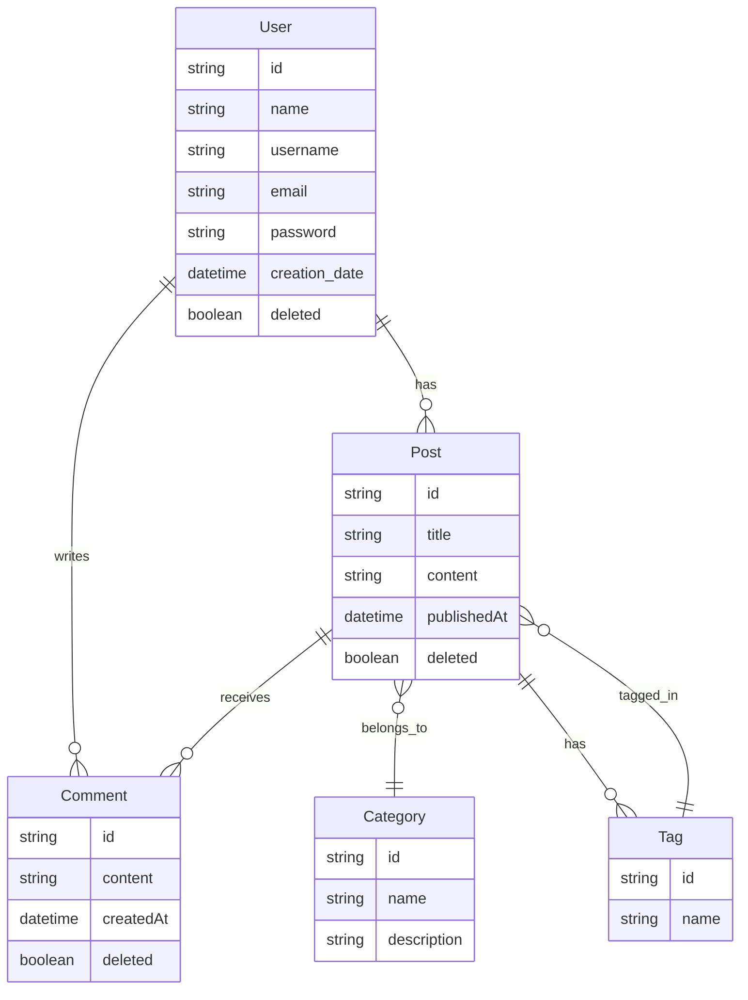

# Diagrama Entidad-Relación (ERD)

Este diagrama representa las relaciones clave entre las entidades principales del sistema.

## Descripción general

- **User** crea **Post** y escribe **Comment**
- **Post** recibe **Comment**, pertenece a una **Category** y tiene múltiples **Tag**
- **Tag** puede estar en múltiples **Post**
- Se usa eliminación lógica (`deleted`) en `User`, `Post` y `Comment` para evitar pérdida permanente de datos.

Este diagrama refleja el modelo de datos del MVP, sujeto a ajustes si se agregan nuevas funcionalidades como favoritos, historial de actividad, etc.
